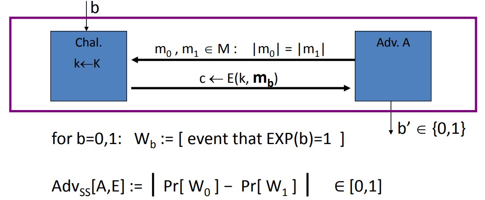
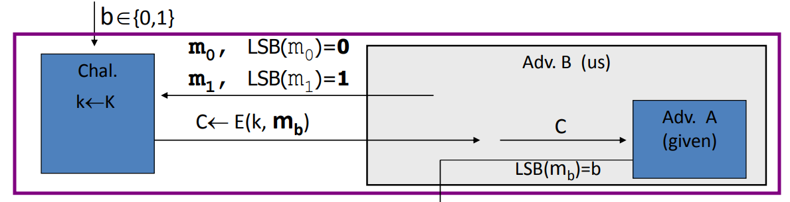
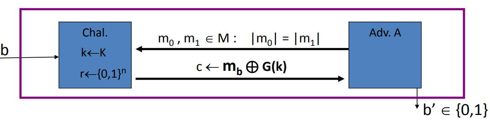
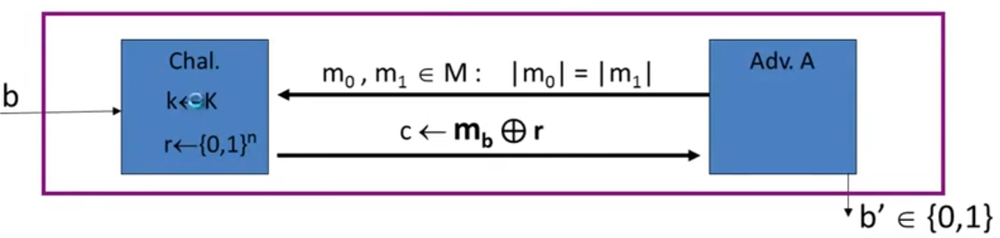
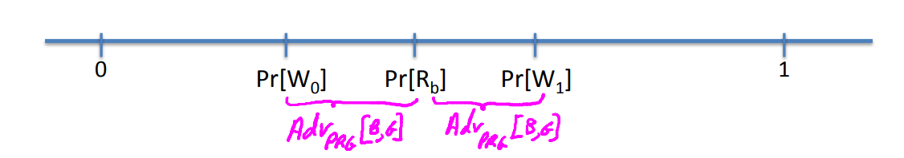

# Semantic Security

## What is a secure cipher?

Attacker's abilities: obtains one ciphertext.(for now)

Security requirements: cypher text  should reveal no information about plain text.

## Perfect Secrecy

Let (E, D) be cipher over (K, M, C), (E, D) has perfect secrecy if $\forall m_0, m_1 \in M (|m_0| = |m_1|)$, there $\{E(k, m_0)\} = \{E(k, m_1)\} \; where \; k \leftarrow K$.

We can require two distributions just be computationally indistinguishable. In other words, a efficient attacker cannot distinguish the two distributions, even the distributions might be very, very very different. That just given a sample for one distribution and a sample for another distribution, the attacker can't tell which distribution he was given a sample from.
$$
\forall m_0, m_1 \in M(|m_0| = |m_1|), \text{ there } \{E(k, m_0)\} \approx_p \{ E(k, m_1) \} \; \text{ where } k \leftarrow K
$$
It turns out this definition is actually still a little too strong that still cannot be satisfied, so we have to add one more constraint, and that is instead of saying that this definition should have hold for all $m_0$ and $m_1$. It is to hold for **only pairs $(m_0, m_1)$** that the attacker could actually exhibit.

## Semantic Security

The way to define semantic security is by defining two experiments: experiment 0 and experiment 1. We will think of these as $B_0$ and $B_1$. An adversary $A$ try to break the system. There is one hallengers.

The first thing the challenger is gonna do is pick a random key and then the adversary is going to output two messages $m_0$ and $m_1$. This is an explicit pair of messages that the attacker wants to be challenged on and as usual we're not trying to hide the length of the messages. We require that the messages be equal. And then the challenger will output either the encryption of $m_0$ or the encryption of $m_1$. So in experiment 0, the challenger will output the encryption of $m_0$. In experiment 1, the challenger will output the encryption of $m_1$. And then the adversary is trying to guess whether he was given the encryption of $m_0$ or given the encryption of $m_1$. We define the $W_b$ to be the events that an experiment $b$ the adversary output 1. So $W_0 = [B_0 = 1]$ means that the adversary output 1 in experiment $B_0$.
$$
for \; b=0,1: \; W_b =[B_b=1 ]
$$
Now we can define the advantage of this adversary, which is called the semantics security advantage of the adversary $A$ against the scheme $E$, to be the difference of the probability of there two events.
$$
Adv_{SS}[A, E] = |Pr[W_0| - Pr[W_1] | 
$$
If in both experiments the adversary output 1with the same probability that means the adversary wasn't able to distinguish the two experiments. Experiments zero looks to the adversary the same to the experiment 1.

**Definition**: For all efficient adversaries the advantage is negligible. In other words, no efficient adversary can distinguish the encryption of $m_0$ from the encryption of $m_1$. This is what is says repeatedly that for these two messages that the adversary was able to exhibit, he wasn't able to distinguish these two distributions.
$$
\text{for all explicit } m_0, m_1 \in M: \{E(k, m_0)\} \approx_p \{E(k, m_1)\}
$$

### Examples

1.Suppose efficient $A$ can always deduce LSB of plain text from cipher text. Then scheme $(E, D)$ is not semantically secure.

## OTP is  Semantically Secure

The first thing the adversary is gonna do is he's gonna output two messages $m_0, m_1 \in M: |m_0| = |m_1|$ of the same length. Now he gets either the encryption of $m_0$ or the encryption of $m_1$ under the one time pad. And he's trying to distinguish between those two possible cipher texts that he gets. Wht is the advantage of adversary $A$ against one time pad?
$$
Add_{SS}[A, E] = |Pr[A(k \oplus m_0) = 1] - Pr[A(k \oplus m_1) = 1]| = 0
$$

The property of the one time pad is that, $k \oplus m_0$ is distributed identically to $k \oplus m_1$. In other words, these distributions are absolutely identical distribution. As a result, the advantage of $A$ is 0.

## Stream Ciphers are Semantically Secure

**Theory**: $G: K \to \{0, 1\}^n$ is a secure PRG, then stream cipher scheme derived from $G$ is semantically secure.

**Proof**:Let $A$ be a semantic security adversary against the stream cipher,  There's a challenger, which starts off by choosing the key $k$, and then the adversary is gonna output two messages, two equal length messages. And he's gonna receive the encryption of $m_0$ or $m_1$ and outputs $b'$.

Let challenger also choose a random $r$, we're going to instead of encrypting using key $k$, we're going to encrypt using $r$. The property of the pseudo-random generator is that its output is indistinguishable from truly random. So because the generator is secure, the adversary can't tell that we made this change. The adversary can't tell that we switched from a pseudo-random string to a truly random string. The advantage of the adversary is 0. Because the adversary couldn't have told the difference when we moved from pseudo random to random. So  he couldn't win the random game and also he can't win the pseudo random game. As a result, the stream cipher must be secure.

 What we're gonna show is the following: Suppose you give me a semantic security adversary $A$, what we'll do is build PRG adversary $B$ to this inequality here.
$$
Adv_{SS}[A, E] \leq 2 \cdot Adv_{PRG}[B, G]
$$
When we're actually using a pseudo-random pad, we're gonna use $W_0$ and $W_1$ to denote the event that $A$ outputs 1. $W_0$ corresponds to outputting 1 when receiving the encryption of $m_0$. And $W_1$ corresponds to output 1 when receiving the encryption of $m_1$. We're gonna to use $R_0$ and $R_1$ to denote the event that $A$ outputs 1 when receiving the one-time pad encryption of $m_0$ or the one-time pad encryption of $m_1$.

**Claim 1**: $|Pr[R_0| - Pr[R_1] = Adv_{SS}[A, OTP] = 0$

**Claim 2**: $\forall b=0, 1 \; \; \exists B: |Pr[W_b| - Pr[R_b]| = Adv_{PRG}(B, E)$

