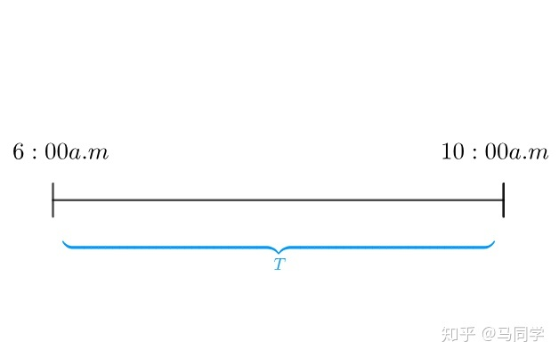
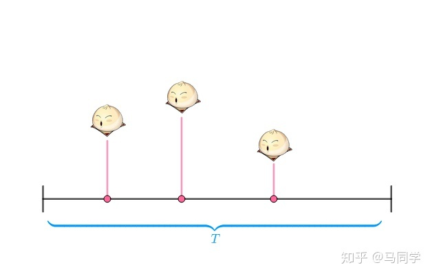
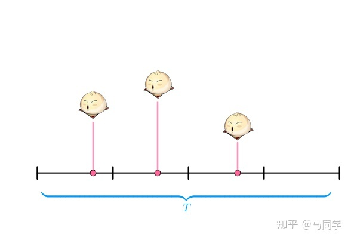
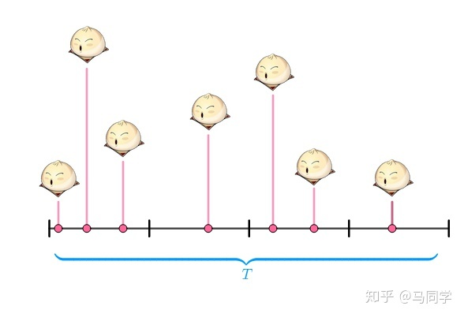
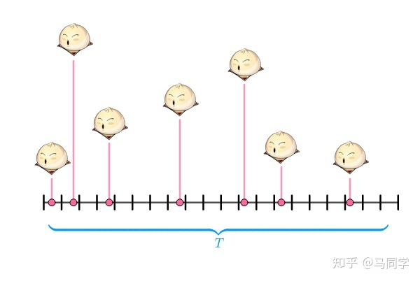

# 泊松分布

## 定义

依据过去某个随机事件在某段时间发生次数的平均次数来预测随机事件在未来同样长的时间内发生k次的概，其概率密度函数如下
$$
P(X=k) = \frac{e^{- \lambda} \lambda ^k}{k!}
$$
其中$\lambda$为过去某段时间随机事件发生的平均次数

## 推导

某早餐店老板统计了一周卖出的馒头

老板尝试把每天的营业时间抽象为一根线，将该段时间用T表示

然后把周一的三个馒头按销售时间放在线段上

把T分为四个时间段，每段时间中要么没卖出馒头，要么只卖出了一个馒头

将4个时间段想象抛了四次硬币，其中有三次硬币是正面朝上(卖出了馒头)，这样概率可以通过二项分布来计算
$$
(_3 ^4)p^3 (1-p)^1
$$
但是，如果把周二的七个馒头放在线段上，分段四段就不够分了，因为在某一段卖出了多个馒头，就不能用二项分布了

将T分为20个时间段，则时间段又变为了抛硬币

相当于抛了20次硬币，有7次硬币证明朝上
$$
(_{7} ^{20})p^7(1-p)^{13}
$$
为了保证一个时间段只会发生卖出一个馒头、没卖出馒头，于是把时间分为n份
$$
(_{7} ^{n})p^7(1-p)^{n-7}
$$
n越细越好，用极限表示为