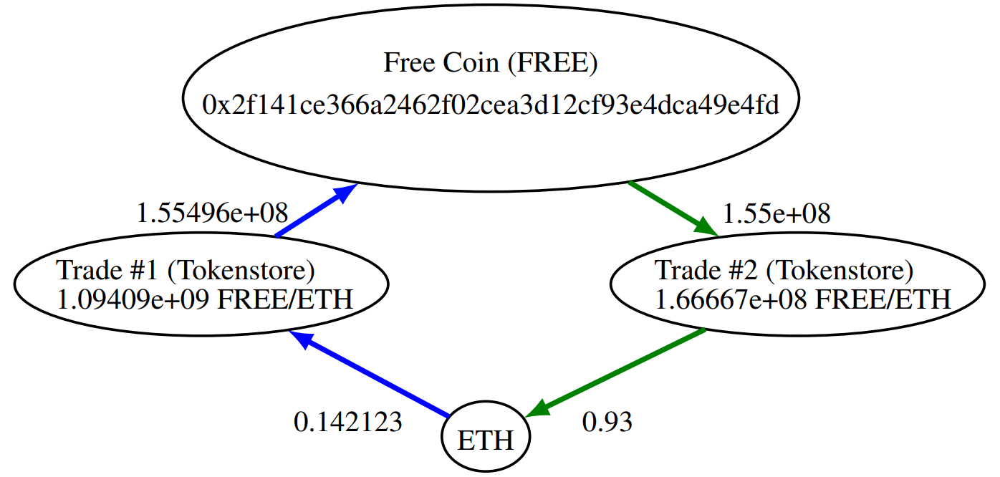
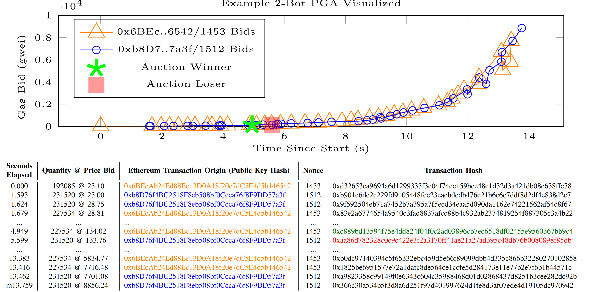
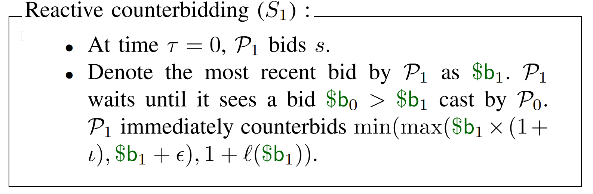
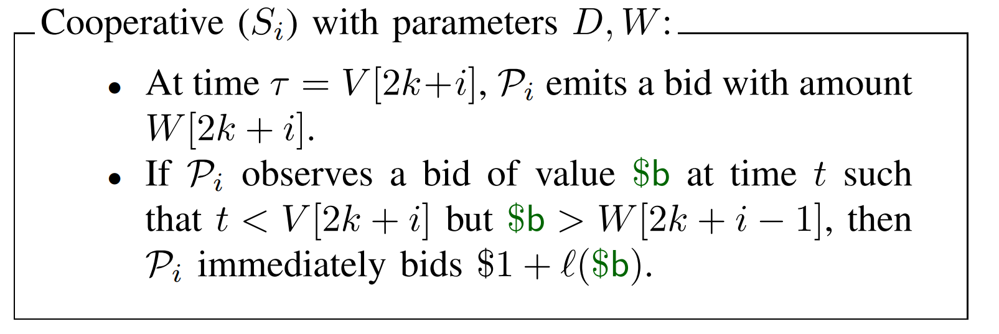

# Flash Boys 2.0: Frontrunning, Transaction Reordering, and Consensus Instability in Decentralized Exchanges

## Background

Centralized exchanges have experienced scandals ranging from high-profile thefts to malfeasance such as price manipulation.

In DEXes(decentralized exchange), adversaries can frontrun orders.

## Contribution

Authors explain that DEX design flaws, study a community of arbitrage bots that has arisen to exploit DEX flaws, measure and model these bots' behavior. Authors main focuses are:

* **Pure revenue opportunities**: Blockchain transactions that issue multiple trades atomically through a smart contract and profit unconditionally in every traded asset.
* **Priority gas auctions(PGAS)**
* **Miner-extractable value(MEV)**: Value that is extractable by miners directly from smart contracts. One particular source of MEV is ordering optimization(OO) fees, which result from a miners' control of the ordering of transactions in a particular epoch.
* **Fee-based forking attacks**: OO fees can incentivize miners to mount forking attacks.
* **Time-bandit attacks**: High-MEV regimes in general lead to a new attack in which miners rewrite blockchain history.

## From Decentralization To Arbitrage

### Pure Revenue by Example

The following picture shows one example of a pure revenue transaction. In this transaction, two trades are executed on a decentralized exchange. The net revenue in each traded asset is the sum of inflows minus outflows in the corresponding asset node. The revenue for ETH was therefore 0.93 ETH - 0.14123 ETH = 0.79 ETH. To calculate the transaction profit, we subtract the cost from the revenue, in this case the gas paid by the transaction that was mined for the arbitrageur. This transaction paid a gas price of 134.02 Gwei and used 113265 gas. Therefor, the total cost of this transaction was 113265 \* 134.02 Gwei = 0.01518 ETH. The associated profit was therefor 0.79 \- 0.1518 = 0.77 ETH.

### PGAs, Ordering Fees, and...HFT?

The following picture shows a auction from the point of view of the network. In this example, we see two accounts, 0x6BEc with nonce 1453 and 0xb8D7 with nonce 1512, bidding against each other for priority. These accounts issue transactions with ever increasing gas prices: bot 0x6BEc issues 42 transactions in 13.4 seconds, and 0xb8D7 issues 43 transactions in 12.1 seconds. In 4.94 seconds, the auction is over. The transaction that eventually ends up mined with priority is shown with a green star, and is transaction 0xc889 issued by bot 0x6BEc. The transaction shown in the red square with hash 0xaa86 by bot 0xb8D7 is also mined and included in the final block. Note that while the winning transaction used 113265 gas in execution, the losing transaction paid for 33547 gas units, a far smaller sum.

## Priority Gas Auction(PGA) Modeling

### Model properties

* **Continuous time**: Players act in continuous time, rather than discrete rounds.
* **Imperfect information**: Players eventually see one another's bids, but not immediately. Player Pi observes other players' bids after some fixed time $\Delta i$
* **All pay**: Losing players pay gas costs for their failed transactions. Authors' model captures this cost by having a losing player P pay $l(\$b_{last})$, where $\$b_{last}$ is the last bid made by P and $l()$ is a loss function.
* **Probabilistic auction duration**: The auction terminates at a randomly determined time, namely when the next block is mined. We model a block interval as a random variable D, which is exponentially distributed.
* **Rate-limited bidding**: A player cannot raise her own bids continuously, but must wait a short interval $\delta$ to do so.
* **Minimum starting bid**: If one bids too low, then even if nobody else bids against them, a miner may not include the transaction in their block. Authors model their auctions as having a minimum starting bid, s.
* **Minimum bid increments**: There is a minimum bid raise, $\iota$, measured as a function of the player's previous bid. The most common Ethereum node software enforces a minimum increment of 12.5%.

### Formal PGA model

For simplicity, authors focus on games where n=2, i.e., that involve a pair of players (P0, P1). Let b=(t, \$,; i) denote a bid by player Pi. Here t is the time at which the bid is placed, \$b is the bid price, and $i \in \{0, 1\}$ is the identity of the bidder. Let $b^{*}$ denote the sequence of all bids published to the network by all players at the current time $t^{*}$, and **b** the full sequence of all bids made by all players up to the point at which the auction ends. A strategy Si for player Pi is a procedure for participating in a PGA. Si takes the following form, where input $t^{*}$ is the current time and $\sigma_i$ is the current local state of Pi:
$$
(a, t_w, \sigma') <- S_i(b^*, t^*, \sigma)
$$
The output a is an auction by Pi. Either a=b for some bid b, or else a=$\bot$, indicating the player is not placing a bid. $\sigma'$ represents an internal state update for the player. Finally, $t_w \ge t^*$ is a wake time. This is the time when Pi schedules its next execution assuming no bids appear in the meantime. A player that chooses not to schedule a bid can set $t_w = \infty$.

a) Game execution: A game between P0 and P1 involves an execution Exec(S0, S1, [D, l()]) of their respective strategies.

b) Payoffs: An execution Exec(S0, $\Delta$0, S1, $\Delta$1, [D, l()]) outputs a pair(\$r0, \$r1). We define the payoff of S0 against S1 as follows:
$$
PO^{Exec}_{(S0, \Delta0)(S1, \Delta1)}[(D, l())] = E[$r0 \; | \; ($r0, $r1) <-Exec(S0, \Delta0, S1, \Delta1, [D, l()])]
$$
we refer to a strategy S0 as null-profitable if $PO^{Exec}_{(S0, \Delta0)(S \varphi , \Delta \varphi )}[(D, l())] > 0$ when $S \varphi $ is the null strategy.

Define
$$
Adv^{exec}_{(S0, \Delta0),(S1, \Delta1)}(D, l()) = PO^{exec}_{(S0, \Delta0),(S1, \Delta1)}(D, l()) - PO^{exec}_{(S1, \Delta1), (S0, \Delta0)}(D, l())
$$

## Priority-Gas-Auction Strategies

### Blind raising

Player Pi raises her own bids under a predetermined schedule. A basic version may be modeled as follows:
$$
\text{Blind raising (S0): P0 emits a bid with amount } \$b_0 \text{ at time T=0 and } \$b_0 * (1+f)^k \text{at time } k\delta
$$

### Counterbidding

Counterbidding is a strategy in which a player observes an opponent's bidding strategy and reacts by placing higher opposing bids.

where $\iota$ is the minimum bid raise that Ethereum requires and $\epsilon$ is the minimum bid raise required to exceed the opponent's price.

#### Observation 1

Let $\Delta i=0$ and $\$r=Adv^{exec}_{(S0, \Delta 0),(S\phi, \phi)}(D, \$c)$ be the payoff of null-profitable blind raising strategy S0 against $S\phi$. Then for
$$
\frac{\$c}{\$r+\$c} \lt e^{-\lambda \delta}
$$
as $\delta -> 0$, reactive counterbidding strategy S1 has positive payoff.

#### Observation 2

For $\Delta1 \gt \delta$, there exists a null-profitable, blind raising strategy, S0, such that for any pure reactive counterbidding strategy S1, S0 achieves $Adv^{exec}_{(S0, \Delta0),(S1, \Delta1)}(D, l()) > 0$

### Cooperation

#### Grim trigger equilibrium

#### Observation 3

In a grim-trigger cooperative PGA, for all $i \leq i_{max}$, the optimal choice for bids is W[0] = s and W[i] = W[i-1] \* (1 + $\iota$)

## Miner-Extractable Value And Blockchain Security

Order optimization(OO) fees a miner is able to reap by leveraging their control of a consensus epoch. To capture OO fees, a miner can reorder users' transactions and potentially insert their own, reaping profit in Ether directly to their account. OO fees represent one case of a more general quantifiable value we call miner-extractable value(MEV). MEV refers to the total amount of Ether miners can extract from manipulation of transactions within a given timeframe.

## References

[Paper](https://arxiv.org/pdf/1904.05234.pdf)

