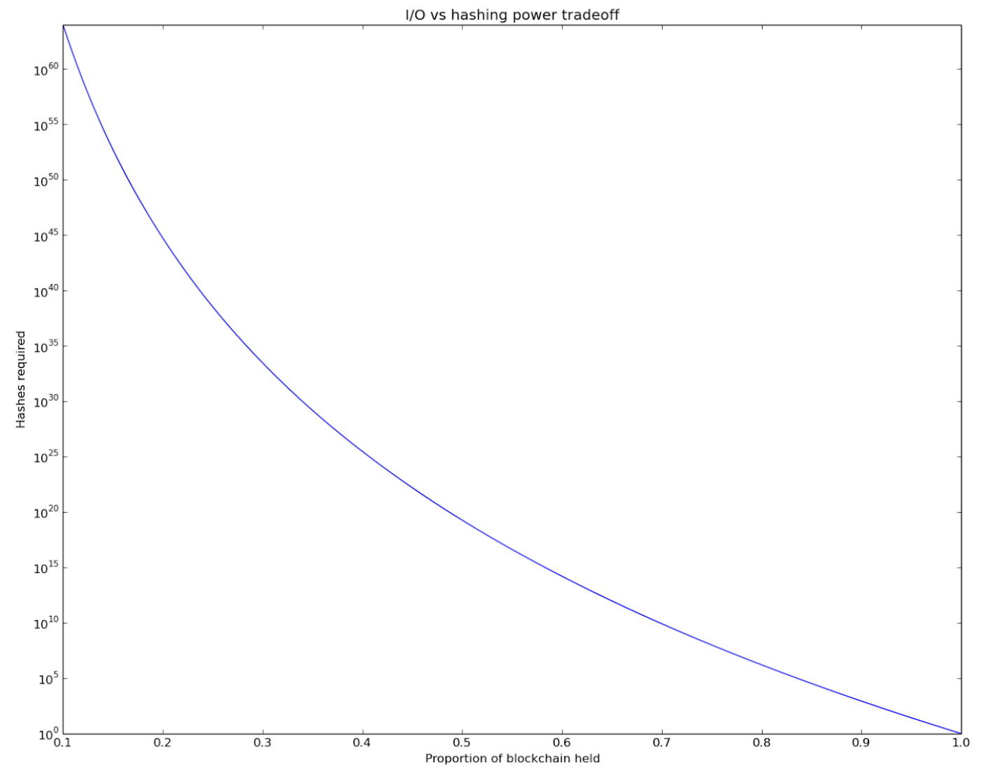

# Hashimoto: I/O绑定的工作量证明

## 提出问题

1.ASIC的出现会让普通的计算机硬件无法有效的用于挖矿，限制了加密货币的适应性

2.PoW可以被外包，类似于矿池，矿工们无需知道交易是否被验证就可以进行PoW

## 利用共享数据集创造I/O绑定证明

在Bitcoin中，hash_put由以下公式计算
$$
hash\_output = sha256(prev\_hash, merkle\_root, nonce)
$$
其中prev\_hash为父区块哈希，merkle_root为交易根哈希，nonce为随机数

Hashimoto使用hash\_output用作第二个哈希函数的输入称为hash\_output\_A，final\_output称为PoW最终结果输出

```js
hash_output_A = sha256(prev_hash, merkle_root, nonce)
for i=0 to 63 do
    shifted_A = hash_output_A >> i
	transaction = shifted_A mod total_transactions
    txid[i] = get_txid(transaction) << i
end for
txid_mix = txid[0] xor txid[1] xor txid[2] ... xor txid[63]
final_output = txid_mix \xor (nonce << 192)
```

* nonce：随机数
* get_txid(T)：将区块链上的交易进行编号，例如815号区块上的第47个交易的编号为141918

hash_output_A用于从区块链中选择64个交易，并将所选择交易的ID向左移位，最后将得到的64个交易ID进行异或运算并将结果与移位后的nonce相异或

该算法只有在区块链扩大到很大时才会变成IO绑定型，在极端情况下，区块链只有1个区块以及1笔交易，那么64个交易的txid都是相同的，而当区块链很大时，需要读取64次内存或者存储

## 瓶颈分析

给定100个区块的区块链，如果一个节点缺少一个区块，那么该节点使用hash\_output\_A计算得到的txid有$0.99^{64} \approx 0.5$的概率可以用于计算最后结果，因此每缺少1%的存储，其计算量得翻倍



该方法可以减缓算力外包，一个服务器维持所有交易的一张表，因此该服务器可以很快得到交易ID，挖矿机器如果一次请求1个交易ID，那么网络开销为64 * 32bytes = 2K，每次请求的延迟为毫秒级别，因此限制了哈希速率为1秒低于1千次哈希运算；如果挖矿机器一次请求所有交易ID，每秒计算1亿次哈希运算，那么需要1tb的网络传输带宽。也就是说每个挖矿节点在本地维护一份区块链的数据拷贝会比算力外包更加快速。

## 参考

[论文链接](../../articles/blockchain/consensus/Hashimoto, I_O bound proof of work.pdf)