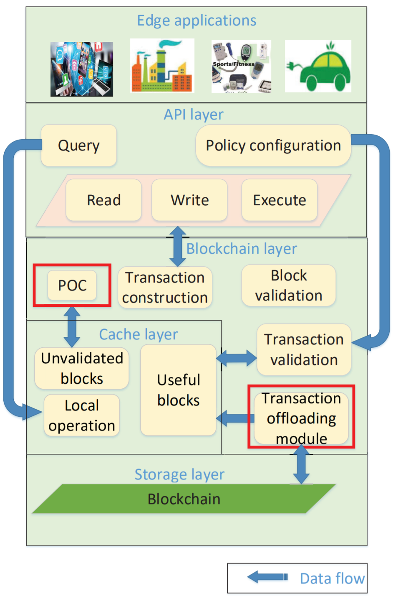
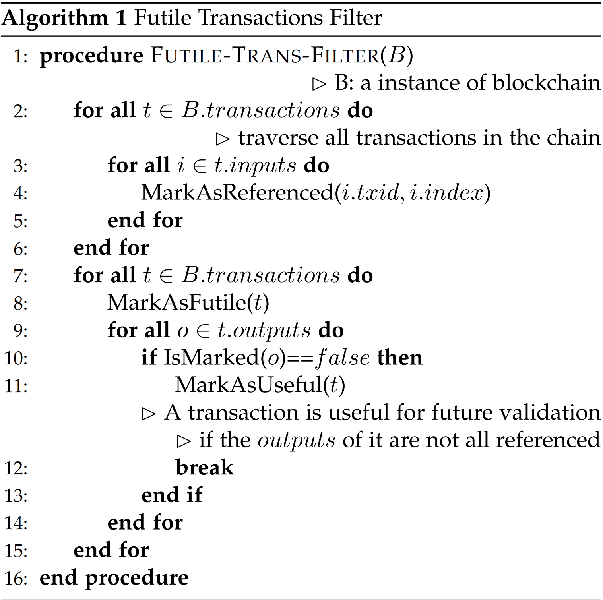
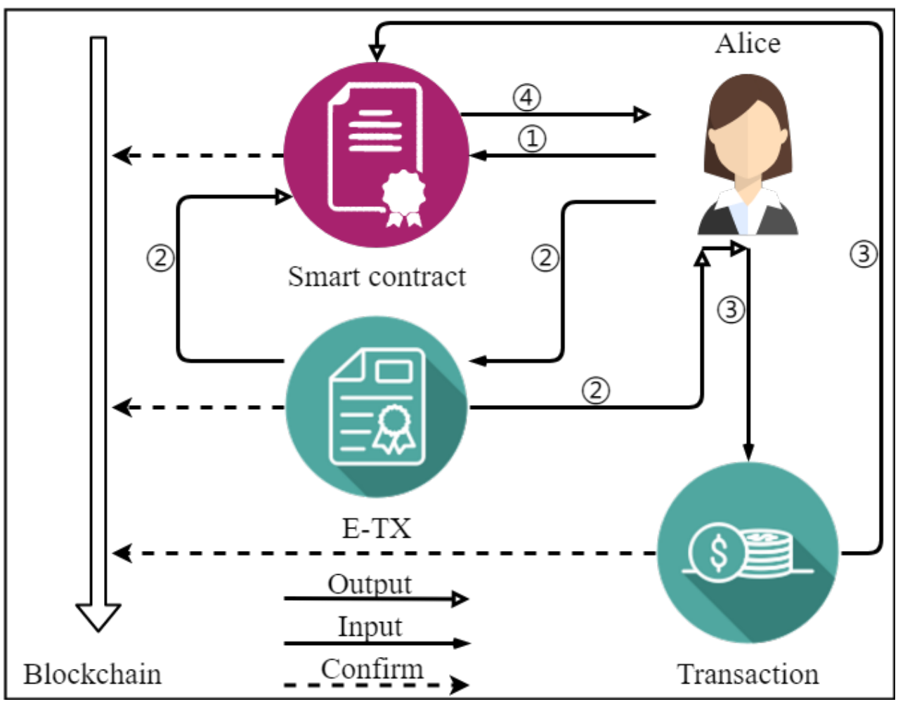
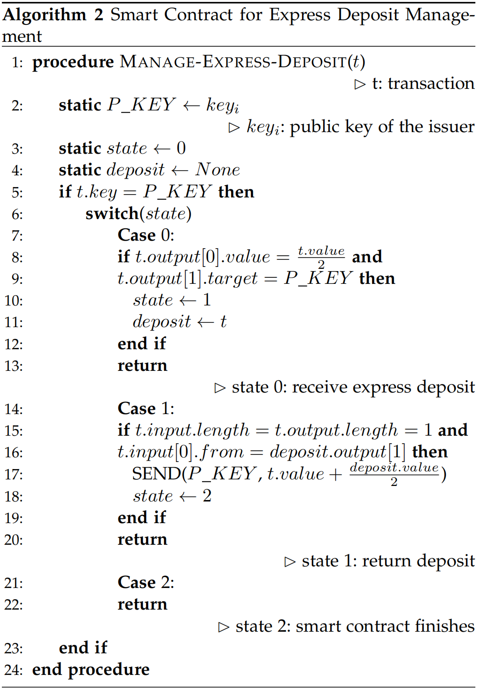

# Making Big Data Open in Edges: A Resource-Efficient Blockchain-based Approach

## 提出问题

1.边缘设备在不信任的环境中共享数据存在抵赖、篡改数据问题

2.区块链方案中，边缘设备的计算能力和网络资源存在差异

## Framework Design

**API层**

将缓存和区块链层的功能抽象，为边缘应用提供接口，其包含三种操作：

* 读、谢、执行交易
* 为边缘设备的操作设计策略配置
* 查询其它边缘设备的数据

**Cache层**

加快调用的响应，其包含本地操作、未验证区块、有效区块

**Blochchain层**

实现了区块链的内容，其包含以下模块

* 交易和区块构造模块，将上层的请求转化为交易和区块
* 交易验证模块，包含交易验证规则
* 交易卸载模块，定位包含有效交易的区块并将其更新到Cache层

**Storage层**

为上层提供持久化存储



## Proof-Of-Collaboration

**交易费计算**
$$
F = \frac{\psi'}{\psi * n}CC/kB
$$
$\psi$:预定义吞吐量阈值，根据设备网络处理能力而设定的最大值

$\psi'$:网络吞吐量平均值，由最近100个区块计算得到

$n$:边缘设备数量

$F$:类似于gas

当网络的平均吞吐量低于设备的预定义吞吐量时，F降低；当网络吞吐量高与设备的预定义吞吐量时，F增大

**CC获得方式**

1.区块打包者可以获得一定量的CC

2.区块打包者可以获得打包交易的交易费

**共识规则**

1.每个参与者的挖矿难度都不同

```shell
SHA256(SHA256(h.n)) < CC * P * target
```

其中CC为打包者拥有的币的数量，P为节点自上次挖矿成功到现在的时间，target为目标值

2.在构建区块时会先花费打包者的CC之后再返还给打包者，此外还会额外支付给打包者CC * P * 0.001%的奖励

3.区块打包者距离下一次挖矿时间必须在[L, R]中
$$
L = \frac{n}{\Theta} \\\\
R = 3L
$$
$\Theta$可以根据需求而改变，通常将其设置为0.75

**共识解释**

1.对于一个设备，其在Bitcoin中所需花费的算力为$E_{pow}$，而对于PoC来说，$E_{PoC}$为一个设备所需花费的算力

2.对于整个网络，规则3限制了参与挖矿设备的数量降低了分叉的概率，因为当一个矿工成功挖取到一个区块后，该矿工需要等待L才能继续参与挖矿
$$
E_{pow} = \frac{target_max}{target} * 2^{32} \\
E_{poc} = \frac{target_max}{CC*P*target} * 2^{32} = \frac{1}{CC*P} * E_{pow}
$$

## Transaction Offloading

不存储无效区块

**无效交易**

交易的所有输出都被花费，那么该交易为无效交易

**无效区块**

如果一个区块中的所有交易都是无效交易，那么该区块为无效区块

**FTF算法**

1.遍历所有交易，将所有交易的输入都记录下来

2.遍历所有交易，对每个交易执行如下操作：

* 如果该交易的某个输出不在步骤1的结果中，那么将该交易标记为有效交易
* 否则标记为无效交易



## Blockchain Network Optimization

**交易或区块的传播方式**

交易和区块在网络上的传播模式可以表示如下，通过该式可以知道交易或区块的传播是同步的
$$
T_{max} = \sum_{i \in \Gamma_{max} \wedge V}T_{i}^{v} + \sum_{j \in \Gamma_{max} \wedge E }T_{j}^{c}
$$
其中$\Gamma$为传播时间最长的路径，V为网络中所有节点，E为所有连接，$T_{i}^{v}$为节点i验证时间，$T_j^c$为节点j的传播时间

**快速交易(E-TX)**

节点发布交易时需要支付额外的快速存储(金额等于E-TX的输出)，当其它节点收到快速交易先将其传播再验证，快速交易一旦通过验证，快速存款将返回给节点，快速交易的传播模式可以表示如下
$$
T_{max}^{'} = max_{i \in \Gamma_{max} \wedge V}T_{i}^{v} + \sum_{j \in \Gamma_{max} \wedge E }T_{j}^{c}
$$


**快速交易算法**



## Hollow block

一旦一个节点收到一个新区块，新区块中的交易会与交易队列中交易重叠，节点浪费了资源来接收已有的交易，具体可以表示如下
$$
|Q_1 \wedge Q_2 \wedge...\wedge Q_i| \approx |Q_T|
$$
其中$Q_i$表示节点i的交易队列中的交易，$Q_T$表示为新区块包含的交易

**Hollow block思想**

将区块包含的交易的哈希替代区块头中的Merkle Root Hash，当节点收到一个新的区块头后，将队列中的交易按照时间顺序排序计算Merkle Root Hash，如果该值与区块头中的Merkle Root Hash一致，则不用请求区块体，如果不一致，则根据交易区块哈希列表请求区块

## 思考

1.快速交易会不会产生过多的交易费？

2.空心区块会不会浪费过多的资源传播交易列表哈希？

[论文链接](../../articles/blockchain/edge_computing/xu2018.pdf)