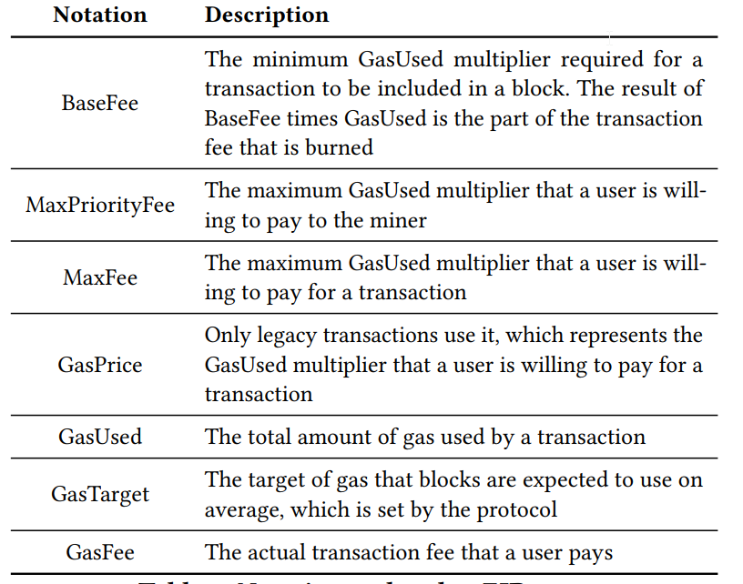
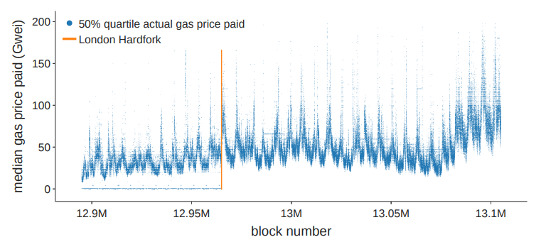
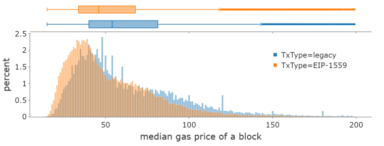
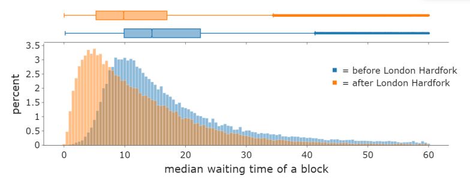
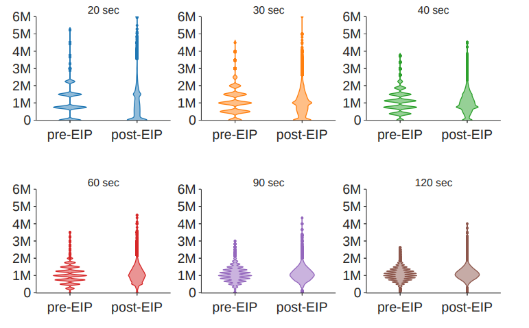

# Empirical Analysis of EIP-1559: Transaction Fees, Waiting Time, and Consensus Security

## Background

A systematic evaluation of the real-word impact of TFMs(Transaction fee mechanism) is still absent.

## Contribution

Answer three questions on the impact of this TFM reform:

* Does EIP-1559 affect the transactions fee dynamics?

  EIP-1559 did not lower the transaction fee level itself but it enabled easier fee estimation for users.

* Does EIP-1559 affect transaction waiting time?

  EIP-1559 lowers transaction waiting time, thus improving the user experience.

* Does EIP-1559 affect consensus security?

  * Fork rate: EIP-1559 increased block size on average, and it also led to an about 3% rise in fork rates.
  * Network load: EIP-1559 does not put the blockchain system under a significantly higher load for an extended period.
  * Miner Extractable Value(MEV): MEV becomes a much lager share of miners' revenue after EIP-1559.

## Preliminary

### Transaction Fee Mechanism prior EIP-1559

The legacy transaction fee mechanism before EIP-1559 is essentially a first-price auction. Users submit a gas price bid for their transactions to outbid competitor. Miners are incentivized to include those with the highest gas prices in a block first.

```python
GasFee = GasUsed * GasPrice
```

### The new TFM in EIP-1559

#### BlockSize

EIP-1559 changes the fixed-sized blocks to variable-sized blocks. The block gas limit is doubled from 15 million to 30 million, while the block gas target is still set at 15 million.

#### Base Fee

Base fee is the minimum gas price that every transaction must pay to be included in a block. If the block gas is greater than the target, the base fee for the next block increases, and vice versa. The dynamics of the base fee is represented as follows:
$$
BaseFee_{h+1} = BaseFee_h(1 + \frac{1}{8} \frac{GasUsed_h - GasTarget}{GasTarget})
$$
Here, h refers to the block height. $BaseFee_h$ and $GasUsed_h$ refer to the base fee and the block gas used in block h. GasTarget is fixed at 15 million.

#### UserBidding

Users can optionally bid two parameters in their transactions, max priority fee per gas and max fee per gas. Priority fees pee gas are the tips with which users incentivize miners to prioritize their transactions. Max fee are the fee caps users will pay including both base fees and priority fees. The difference between the max fee and the sum of the base fee and priority fee, if any, will be refunded to the user. The actual GasPrices of these transactions are calculated by:
$$
GasPrice = min\{BaseFee + MaxPriorityFee, MaxFee\}
$$
For example, if a user bids (MaxFee, MaxPriorityFee) = (60, 2), then there can be several cases depending on the level of base fee in the current block:

* if BaseFee > 60, the transaction must not be included in this block. It waits in the mempool until base fee falls.
* if 58 < BaseFee < 60, the miner choose whether to include this transaction. If the transaction is included, then aside from the base fee, the user pays 60 - Basefee Gwei as a priority fee to miners.
* if BaseFee < 58, the miner can choose whether to include this transaction, If the transaction is included, aside from the base fee, the user pays 2 Gwei as a priority fee to miners.

It is worth noting that users are allowed to follow the legacy bid style and only bid a gas price, in which case the difference between gas price and base fee are taken by miners as tips.

#### Miners' Revenue

The base fee is burned, while the priority fee is rewarded to the miners.



## Data

### Transaction Fee Data

Authors use the standardized IQR of gas prices in blocks to measure intra-block variance of gas prices, defined as
$$
standardized IQR = \frac{Q_{75} (GasPrice) - Q_{25}(GasPrice)}{Q_{50}(GasPrice)}
$$
where $Q_{25}$, $Q_{50}$, $Q_{75}$ refer to the 25th, 50th, and 75th percentile of gas prices paid in a specific block.

### Waiting Time Data

Authors define the waiting time of a given transaction TX as the time the transaction waits in the mempool, namely
$$
\text{Waiting time of TX} = T_{block}^{TX} - T_{mempool}^{TX}
$$
where $T_{mempool}^{TX}$ is the time when the transaction first appears in the mempool and $T_{block}^{TX}$ is the time when transaction is mined.

### Miners' Revenue Data

Authors divide miner's revenue into five categories:

* Static block rewards: 2 ETH per block.
* Uncle inclusion rewards: 1/32 ETH for referencing an uncle block
* Non-FBB gas fees: total gas fees of transactions not in FBBs
* FBB gas fees: total gas fees of transactions in FBBs
* FBB coinbase transfer: total amount of direct payment made by FBBs

### Fork Rate Data

Authors derive the number of "siblings" to show the specific time when forks happen.

## Empirical Results

### Methodology

Authors exploit the gradual adoption of EIP-1559 several weeks after London Hardfork to set up the RDD framework, using the event of London Hardfork and EIP-1559 adoption rate in each block as the independent variables and estimating both immediate effects of London Hardfork and average treatment effects of EIP-1559 adoption. Authors specify the RDD by Eq:
$$
Y = a_{0} + a_1(London Hardfork) + a_2 r_{EIP} + a_3 X + \mu_{h} + \epsilon
$$
Here, $a_1$ is the coefficient for the indicator variable on whether London Hardfork happened. It represents the immediate effect of EIP-1559 on the outcome variable $Y$. $a_2$ is the coefficient for $r_{EIP}$ the percentage of transactions that adopts EIP-1559 after the London Hardfork which represents the effect of an increase in EIP-1559 adoption. X is a set of control variables, an hour fixed-effect term $\mu_{h}$, $\epsilon$ is an error term.

### Transaction Fee Dynamics

The gas price level did not change much before and immediately after the London Hardfork.



The median gas price paid of the EIP-1559 transactions in a block has distribution to the left of that of the legacy transactions.



### Waiting Time

Waiting time significantly reduces after London Hardfork



### Consensus Security

#### Fork rates

EIP-1559 increased block size on average, which led to a higher fork rate. But the influence of EIP-1559 on the number of uncle blocks is marginal.

#### Network load

EIP-1559 does not affect integral network load and frequency of load spikes to a significant degree, especially not for an extended period



#### Miner Extractable Value

EIP-1559 does not change the distribution of MEV revenue in the short term, but it significantly changes that of non-FBB gas fees.


## Reference

[Paper](./../articles/blockchain/other/Empirical_Analysis_of_EIP-1559.pdf)

