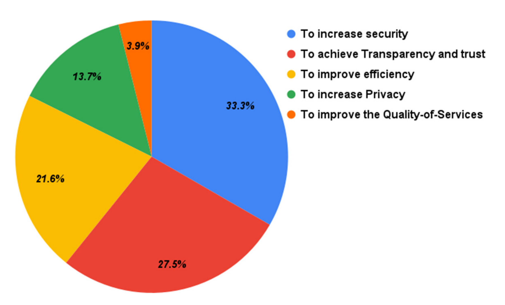
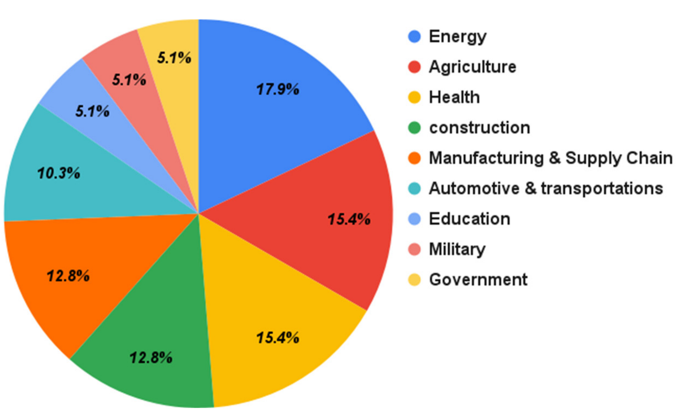
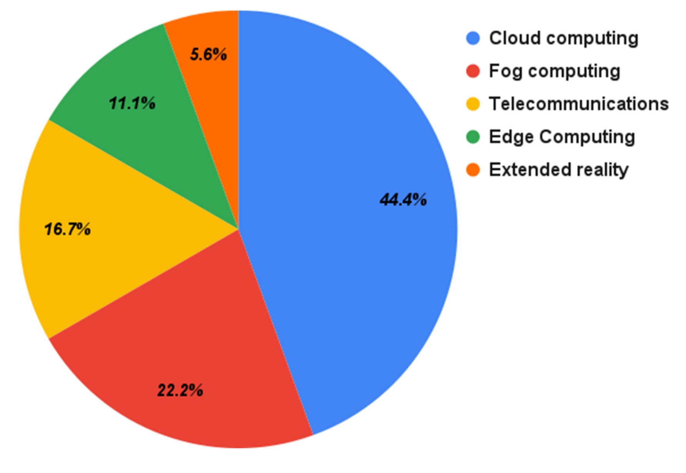
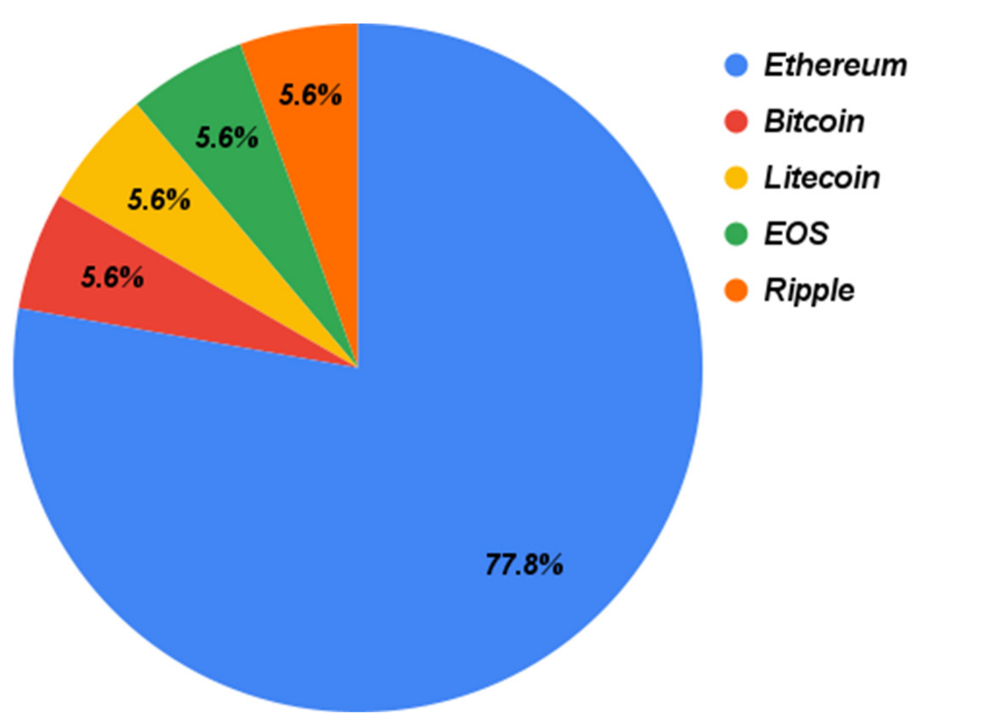
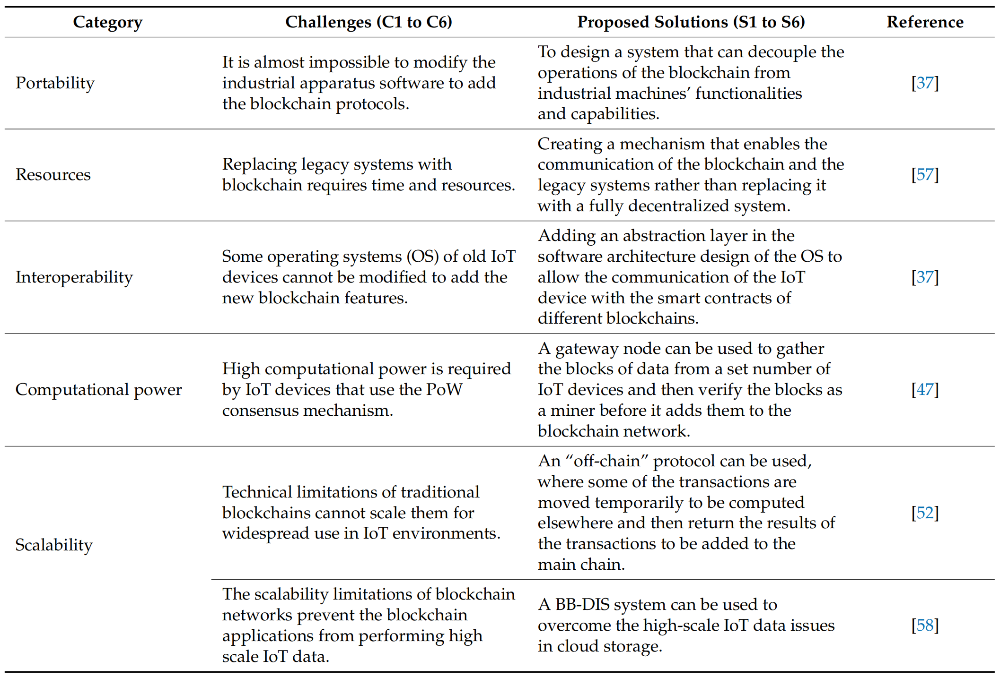

# Hybrid Blockchain Platforms for the Internet of Things(IoT):A Systematic Literature Review

Research Questions

* What are the key motivations for adopting hybrid blockchain？
* What kind of domains has it been applied to？
* What are the adopted technologies in IoT and blockchain integration？
* What are the blockchain platforms used in the IoT and blockchain integration？
* What are the key challenges and possible solutions of IoT and blockchain integration？

What are the key motivations for adopting hybrid blockchain？

What kind of domains has it been applied to？

What are the adopted technologies in IoT and blockchain integration？

What are the blockchain platforms used in the IoT and blockchain integration？

What are the blockchain platforms used in the IoT and blockchain integration？

