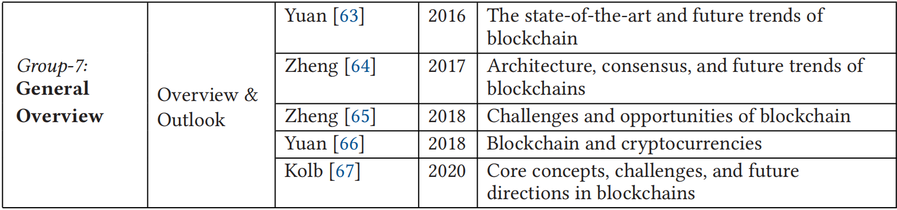
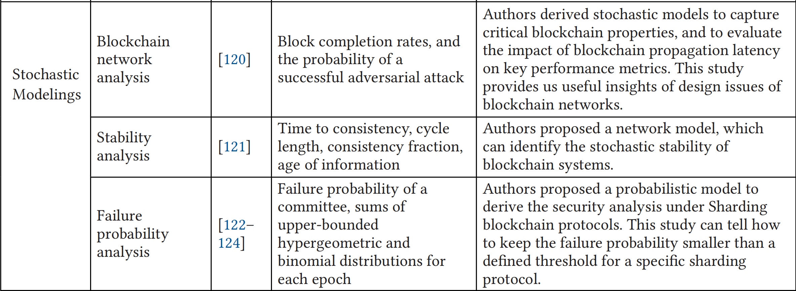

# A Survey of State-of-the-Art on Blockchains：Theories，Modelings，and Tools

## Introduction

### 区块链研究分类

收集的67篇区块链相关研究的文章中，排名前三的主题为：物联网、共识机制、安全和隐私

#### 区块链底层

共识机制、智能合约、分片、伸缩性、跨链、安全和隐私

#### 数据挖掘

#### 决策技术

#### 新通讯网络

#### 物联网与工业物联网

#### 区块链应用

#### 通用回顾

## 预备知识

### 主要的区块链平台

Bitcoin、Ethereum、Hyperledger Fabric、EOSIO

### 共识机制

PoW、PoS

### 区块链伸缩性

链下技术(Off-chain)、DAG、分片技术、跨分片交易(Cross-Shard)

## 提升区块链性能的理论

### 最新的提升区块链性能的理论

吞吐量和时延

存储效率

区块链可靠性

### 提高伸缩性的方法

分片

多链和跨链

### 新协议和基础设施

区块链新协议

区块链的新基础设施和架构

### 助于理解区块链的各种模型和技术

基于图的理论

随机模型

队列理论

区块链网络的分析模型

## 区块链实用的措施、数据集和实验工具

区块链性能测量和数据集

针对区块链有用的评价工具

[论文连接](../../articles/blockchain/review/Theories_Modelings_Tools.pdf)

