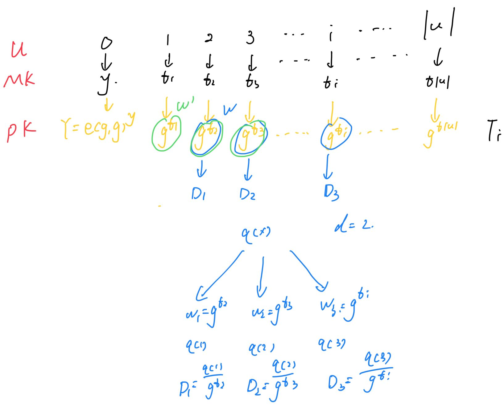
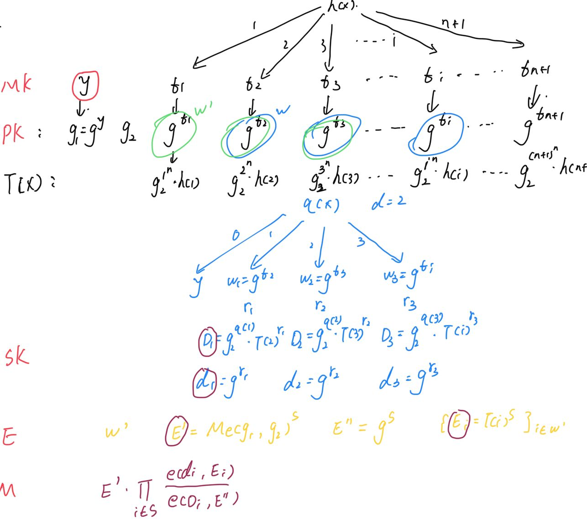

# Fuzzy Identity-Based Encryption

In a Fuzzy Identity-Based Encryption scheme, a user with the secret key for the identity $w$ is able to decrypt a ciphertext encrypted with the public key $w'$ if and only if $w$ and $w'$ are within a certain distance of each other as judged by some metric.

## Construction

Let$G_1$ be bilinear group of prime order $p$, and let $g$ be a generator of $G_1$. Additionally, let $e:G1 \times G_1 \to G_2$ denote the bilinear map. A security parameter $k$ will determine the size of the groups. Defining the Lagrange coefficient $\Delta_{i, S}$ for $i \in Z_p$ and a set $S$ of elements in $Z_p$.
$$
\Delta_{i, S(x)} = \prod_{j \in S, j \neq i}\frac{x-j}{i-j}
$$
Identities will be element subsets of some universe, $\mathcal{U}$, of size $|\mathcal{U}|$.

### Setup(d)

First define the universe, $\mathcal{U} = 1,2..,\mathcal{|U|}$.

Next, choose $t_1,...,t_{|\mathcal{U}|}$ uniformly at random from $Z_p$. Finally, choose $y$ uniformly at random in $Z_p$. The published public parameters are:
$$
T_1 = g^{t_1}, ...., T_{|\mathcal{U}|}=g^{t_{|\mathcal{U}|}}, Y=e(g, g)^y
$$
The master key is:
$$
t1,...,t_{|\mathcal{U}|}, y
$$

### Key Generation

To generate a private key for identity $w \subseteq \mathcal{U}$ the following steps are taken. A $d-1$ degree polynomial $q$ is randomly chosen such that $q(0)=y$. The private key consists of components, $(D_i)_{i \in w}$, where $D_i = g^{\frac{q(i)}{t_i}}$ for every $i \in w$.

### Encryption

A ramdom value $s \in Z_p$ is chosen. The ciphertext is then published as:
$$
E = (w', E'=MY^s, \{E_i=T_i^s\}_{i \in w'})
$$
Note that the identity $w'$ is included in the ciphertext.

### Decryption

Suppose that a ciphertext, E, is encrypted with a key for identity $w'$ and we have a private key for identity $w$, where $|w \cap w'| \geq d$. Choose an arbitrary d-element subset, S, of $w \cap w'$. Then, the ciphertext can be decrypted as:
$$
E' / \prod_{i \in S}(e(D_i, E_i))^{\Delta_{i, S(0)}} = M
$$

## Large Universe Construction

### Setup(n, d)

First choose $g_1=g^y, g_2 \in G_1$. Next, choose $g^{t_1},...,g^{t_{n+1}}$ uniformly at random from $G_1$. Let N be the set {1, ..., n+1} and we define a function, T, as:
$$
T(x) = g_2^{x^n} \prod_{i=1}^{n+1} g^{t_i{\Delta_{i, N(x)}}}
$$
We can view $T$ as the function $g_2^{x^n}g^{h(x)}$ for some n degree polynomial $h$. The public key is:
$$
PK = (g_1, g_2, g^{t_1}, ...., g^{t_{n+1}})
$$
The master key is $y$.

### Key Generation

To generate a private key for identity $w$ the following steps are taken. A $d - 1$ degree polynomial $q$ is randomly chosen such that $q(0) = y$. The private key consist of two sets. The first set, $\{D_i\}_{i \in w}$, where the elements are constructed as
$$
D_i = g_2^{q(i)}T(i)^{r_i}
$$
where $r_i$ is a random member of $Z_p$ defined for all $i \in w$.

The other set is $\{d_i\}_{i \in w}$ where the elements are constructed as
$$
d_i = g^{r_i}
$$

### Encryption

Encryption with the public key $w'$ and message $M \in G_2$ proceeds as follows. First, a random value $s \in Z_p$ is chosen. The ciphertext is then published as :
$$
E =(w', E'=Me(g_1, g_2)^s, E''=g^s, \{E_i=T(i)^s\}_{i \in w'})
$$

### Decryption

Suppose that a ciphertext, $E$, is encryptd with a key for identity $w'$ and we have a key for identity $w$, where $w \cap w' \geq d$. Choose an arbitrary d-element subset, $S$, of $w \cap w'$. Then the ciphertext can be decrypted as:
$$
M = E' \prod_{i \in S}(\frac{e(d_i, E_i)}{e(D_i, E'')})^{\Delta_{i, S(0)}}
$$

## Reference

[paper](https://sci-hub.se/https://doi.org/10.1007/11426639_27)