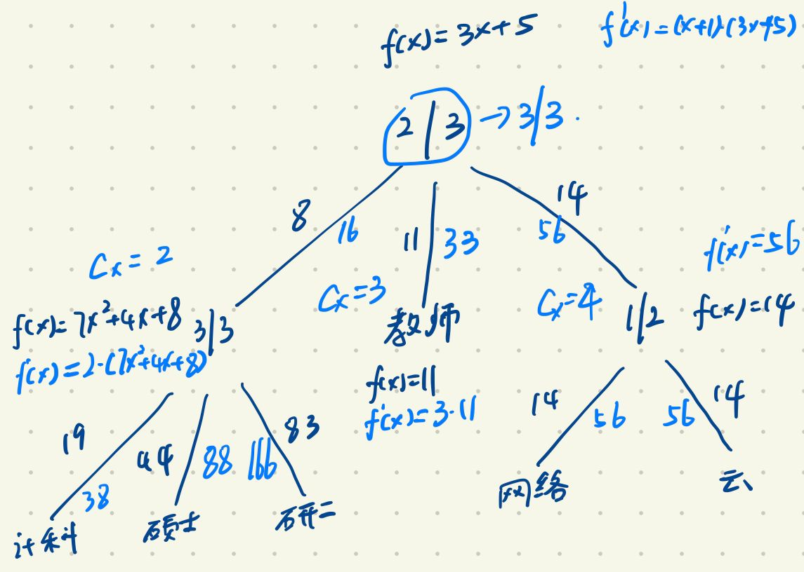

# Attribute-Based Encryption for Fine-Grained Access Control of Encrypted Data

In Key-Policy Attribute-Based Encryption(KP-ABE), the access structure is specified in the private key, while the ciphertexts are simply labeled with a set of descriptive attributes.

## Construction

Let $G_1$ be a bilinear group of prime order $p$, and let $g$ be a generator of $G_1$. In addition, let $e: G_1 \times G_1 \to G_2$ denote the bilinear map. Defining the Lagrange coefficient $\Delta_{i, S}$ for $i \in Z_p$ and a set, $S$, of elements in $Z_p: \Delta_{i, S(x)} = \prod_{j \in S, j \neq i}\frac{x-j}{i-j}$. 

### Setup

Define the universe of attributes $U = \{1, 2, 3..., n\}$. Now for each attribute $i \in U$, choose a number $t_i$ uniformly at random from $Z_p$. Finally, choose $y$ uniformly at random in $Z_p$. The published public parameters $PK$ are:
$$
T_1 = g^{t_1},....,T|U| = g^{t_{|U|}}, Y=e(g, g)^y
$$
The master key $MK$ is:
$$
t_1, ..., t_{|U|}, y
$$

### Encryption

To encrypt a message $M \in G_2$ under a set of attributes $\gamma$, choose a random value $s \in Z_p$ and public the ciphertext as:
$$
E = (\gamma, E'=MY^s, \{E_i=T_i^s\}_{i \in \gamma})
$$

### Key Generation

The algorithm first generate a polynomial $q_x$ for each node x in the tree. For the root node $R$, set $q_R(0) = y$. Then for each leaf node $x$, calculate as  followings:
$$
D_x = g^{\frac{q_x(0)}{t_i}} \text{ where } i=att(x)
$$

### Decryption

First define a recursive algorithm $DecryptNode(E, D, x)$. It outputs a group element of $G_2$ or $\bot$. Let $i = att(x)$. If the node $x$ is a leaf node then:
$$
DecryptNode(E, D, x) = \begin{cases}
							e(D_x, E_i) = e(g^{\frac{q_x(0)}{t_i}}, g^{s \cdot t_i}) = e(g, g)^{s \cdot q_x(0)} \text{ if } i \in \gamma \\
							\bot
						\end{cases}
$$
Now consider the recursive case when $x$ is a non-leaf node. The algorithm proceeds as follows: For all nodes $z$ that are children of $x$, it calls $DecryptNode(E, D, z)$ and stores the output as $F_z$. Let $S_x$ be an arbitrary $k_x$-sized set of child nodes $z$ such that $F_z \neq \bot$. If no such set exists then the node was not satisfied and the function returns $\bot$. Otherwise, we compute:
$$
\begin{align}
F_x &= \prod_{z \in S_x} F_z^{\Delta_{i, S_x'(0)}} \text{ where }
		\begin{cases}
			i = index(z) \\
			S_x' = \{index(z): z \in S_x\}
		\end{cases}\\
	&= e(g, g)^{s \cdot q_x(0)}
\end{align}
$$
We can get message $M$  as follows:
$$
\begin{align}
M &= \frac{E'}{DecryptNode(E, D, r)} \\
  &= \frac{M e(g, g)^{sy}}{e(g, g)^{sy}}
\end{align}
$$

## Large Universe Construction

### Setup

Choose a random value $y \in Z_p$ and let $g_1 = g^y$. Now choose a random element $g_2 \in G_2$. Next, choose $t1,...., t_{n+1}$ uniformly at random from $Z_p$. Let N be the set $\{1, 2, ...., n+1\}$. Define a function $T$, as:
$$
T(X) = g_x^{X^n} \prod_{i=1}^{n+1} g^{t_i \cdot \Delta_{i, N(X)}}
$$
Function $T$ can be viewed as the function $g_2^{X^n} g^{h(X)}$ for some $n$ degree polynomial $h$. The public parameters PK are $g_1, g_2, g^{t_1}, ...., g^{t_{n+1}}$ and master key $MK$ is $y$.

### Encryption

To encrypt a message $m \in G_2$ under a set of attributes $\gamma$, choose a random value $s \in Z_p$ and public the ciphertext as:
$$
E=(\gamma, E'=Me(g_1, g_2)^s, E''=g^s, \{E_i=T(i)^s\}_{i \in \gamma})
$$

### Key Generation

The algorithm first generate a polynomial $q_x$ for each node x in the tree. For the root node $R$, set $q_R(0) = y$. Then for each leaf node $x$, calculate as  followings:
$$
\begin{align}
D_x &= g_2^{q_x(0)} \cdot {T(i)^{r_x}} \text{ where } i=att(x) \\
R_x &= g^{r_x}
\end{align}
$$
where $r_x$ is chosen uniformly at random form $Z_p$ for each node $x$.

### Decryption

As for the case of small universe, we first define a recursive algorithm $DecryptNode(E, D, x)$. It outputs a group element of $G_2$ or $\bot$ as follows. Let $i=att(x)$. If the node $x$ is a leaf node then:
$$
DecryptNode(E, D, x) = \begin{cases}
							\frac{e(D_x, E'')}{e(R_x, E_i)} = e(g, g_2)^{s \cdot q_x(0)} \text{ where } i \in \gamma \\
							\bot
						\end{cases}
$$
Now consider the recursive case when $x$ is a non-leaf node. The algorithm proceeds as follows: For all nodes $z$ that are children of $x$, it calls $DecryptNode(E, D, z)$ and stores the output as $F_z$. Let $S_x$ be an arbitrary $k_x$-sized set of child nodes $z$ such that $F_z \neq \bot$. If no such set exists then the node was not satisfied and the function returns $\bot$. Otherwise, we compute:
$$
\begin{align}
F_x &= \prod_{z \in S_x} F_z^{\Delta_{i, S_x'(0)}} \text{ where }
		\begin{cases}
			i = index(z) \\
			S_x' = \{index(z): z \in S_x\}
		\end{cases}\\
	&= e(g, g_2)^{s \cdot q_x(0)}
\end{align}
$$
We can get message $M$  as follows:
$$
\begin{align}
M &= \frac{E'}{DecryptNode(E, D, r)} \\
  &= \frac{M e(g_1, g_2)^{s}}{e(g, g_2)^{sy}}
\end{align}
$$

## Delegation of Private Keys

In large universe construction, individual users can generate new private keys using their keys, which can then be delegated to other users. A user which has a private key corresponding to an access tree $\mathcal{T}$ can compute a new private key correspoding to ANY access tree $\mathcal{T}'$  which is more restrictive than $\mathcal{T}$.

### Adding a new trivial gate to $\mathcal{T}$

This operation involves adding a new node $y$ above an existing node $x$. The new node $y$ represents a (1, 1) threshold gate which after adding becomes the parent of $x$. The former parents of $x$, say $z$, becomes the parent of $y$. We set the polynomial $q_y$ such that $q_x(0) = q_y(index(x))$ and $q_y(0) = q_z(index(y))$

### Manipulating an existing(t, n)-gate in $\mathcal{T}$

#### Converting a (t, n)-gate to a (t+1, n)-gate with (t+1)

Consider a node $x$ representing a (t, n)-gate. Define a new polynomial $q_x'$ as follows:
$$
q_x'(X) = (X+1) q_x(X)
$$
For every child $y$ of $x$, compute the constant $C_x = index(y) + 1$. For every leaf node $z$ in the subtree $\mathcal{T}_y$, compute the new decryption key as:
$$
D_z' = (D_z)^{C_x}, R_z' = (R_z)^{C_x}
$$
Then multiply all the polynomials in the subtree $\mathcal{T}_y$ with the constant $C_x$. 

#### Converting a (t, n)-gate to a (t+1, n+1)-gate

This procedure involves adding a new subtree(with root say $z$) as a child of a node $x$ while increasing the degree of $x$ by 1 at the same time. Let $z$ be the $v^{th}$ child of $x$ so that index($z$)=$v$. We shall change the polynomial $q_x$ to the following:
$$
q_x'(X) = (aX+1)q_x(X) \text{ where } a=\frac{-1}{v}
$$
As in the previous operation, for every child $y$ of $x$, the polynomials in the subtree $\mathcal{T}_y$ are the multiplied with the appropriate constant $C_x = a \cdot index(y) + 1$.

#### Converting a (t, n)-gate to a (t, n-1)-gate

Just delete a child $y$ of a node $x$.

### Re-randomizing the obtained key

Re-randomization of a node $x$ with a constant $C_x$ is done as follows. Choose a random polynomial $p_x$ of degree $d_x$ such that $p_x(0) = C_x$. Define the new polynomial $q_x'(X) = q_x(X) + p_x(X)$. This is done by recursively re-randomizing every child $y$ of $x$ with the constant $C_y = p_x(index(y))$. If $y$ is a leaf node, the new decryption key corresponding to $y$ is computed as follows:
$$
D_y'=D_y \cdot g_2^{C_y} \cdot T(i)^{r_y}, R_y'=R_y \cdot g^{r_y}
$$
Where $i=att(y)$ and $r_y$ is chosen randomly. We start re-randomizing the root node $R$  with the constant $C_r=0$.

