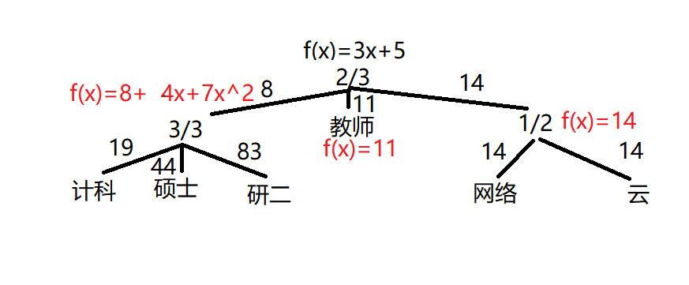
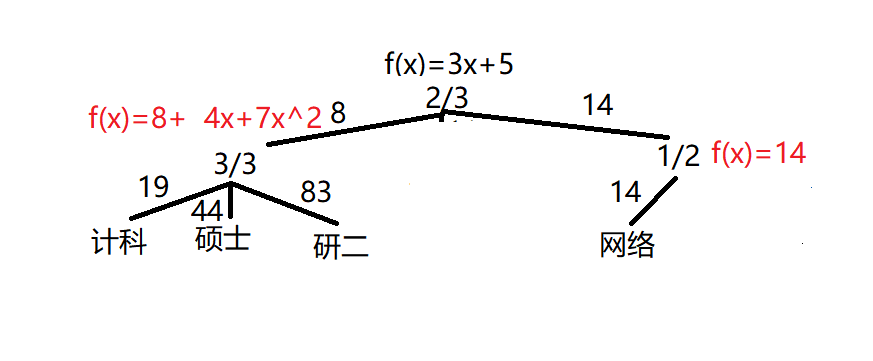

# Ciphertext-Policy Attribute-Based Encryption

> With the help of my  colleague, I have a basic understanding of the CPABE algorithm. This article mainly describes some of my understanding of the CPABE algorithm.

## Setup

The setup algorithm will choose a bilinear group $G_1, G_2$ of prime order p with generator $g_1, g_2$.Next it will choose two random exponents $\alpha, \beta \in Z_p$. The public key is published as:
$$
PK = g_1, g_2, h=g^{\beta}, f=g^{1/\beta}, e(g1, g2)^{\alpha} \\\\
MK = \beta, g_{2}^{\alpha}
$$
The setup algorithm is easy to understand. It just chooses two random number and calculate the parameters of the public key and master key.

## Encrypt(PK, M, T)

The encryption algorithm encrypts a message M under the tree access structure T, so we need construct a access tree first. The algorithm first chooses a polynomial $q_x$ for each node x in the tree T. These polynomials are chosen in the following way in a top-down manner, starting from the root node R. For each node x in the tree, set the degree $d_x$ of the polynomial $q_x$ to be one less than the threshold value $k_x$. Starting with the root node R the algorithm chooses a random $s \in Z_p$ and set $q_R(0) = s$. Then, it chooses $d_R$ other points of the polynomial $q_R$ randomly to define it completely. For any other node x, it sets $q_x(0)=q_{parent(x)}(index(x))$ and chooses $d_x$ other points randomly to completely define $q_x$.

Suppose this tree looks like the image below:

* first, we need choose a random number s for root so that $q_r(0) = s$. We let the value of s be 5, so the polynomial is $q_r(x)=ax+5$. Then we still choose a random number for a, we can specify the value of a to be 3. Ultimately, the polynomial is $q_r(x)=3x+5$.
* next, we should give out secret keys for the root's children. To calculate the secret key of 3/3 this node , we need let the value of x in $q_r(x)$ be 1, the result is 8. The others is similar, we use 2 and 3 to calculate the secret value of 教师 node and 1/2 node，which result are 11 and 14. The remaining procedures to compute polynomials is the same as the first step. Ultimately, we can get the result as following:

Now, we can use access tree to compute Encrypt algorithm. The cipher text is as following:
$$
CT = (T, \tilde{C}=Me(g1, g2)^{as}, C=h^s, \forall y \in Y: C_y=g_1^{q_y(0), C_y'=H(att(y))^{q_y(0)}})
$$
Where, Y is the set of leaf nodes in T.

## KeyGen(MS, S)

The key generation algorithm will take as input a set of attributes S and output a key that identifies with the set. The algorithm first chooses a random $r \in Z_p$, and then random $r_j$ for each attribute $j \in S$. Then it computes the key as 
$$
SK = (D = g^{(\alpha + r)/\beta}, \forall j \in S: D_j=g_2^r H(j)^{r_j}, D_j'=g_1^{r_j})
$$
Where H is a function that map a attribute to a element in $G_2$.

For example, there is a person whose attribute are (计科, 硕士, 研二, 网络), and we can get SK as following:
$$
SK = (D = g^{(\alpha + r)/\beta}, \\\\
D_{计科}=g_2^r H(计科)^{r_{计科}}, D_{计科}'=g_1^{r_{计科}}, \\\\
D_{硕士}=g_2^r H(硕士)^{r_{硕士}}, D_{硕士}'=g_1^{r_{硕士}}, \\\\
D_{研二}=g_2^r H(研二)^{r_{研二}}, D_{研二}'=g_1^{r_{研二}}, \\\\
D_{网络}=g_2^r H(网络)^{r_{网络}}, D_{网络}'=g_1^{r_{网络}})
$$

## Decrypt(CT, SK)

The algorithm decrypts by computing
$$
\tilde{C} / (e(C, D) / A) = \tilde{C} / (e(h^s, g_2^{(\alpha+r)/\beta}) / e(g_1, g_2)^{rs})
$$
Where $A = e(g_1, g_2)^{rs}$. Attention, the Decrypt function take as input cipher text CT and SK and output a message M, so the input doesn't contain the access tree T. But in the above expression, s is the root node's secret value, how can we get the value of $e(g_1, g_2)^{rs}$? The need to use the decrytNode function.

### DecryptNode(x)

Before we discuss the algorithm, let's think about a question. Given a access tree, how can we get the root node's secret by calculating the children nodes' secrets? 

For example, if we just know the secrets of 计科、硕士、研二 which are 19,44,83 respectively, how can we get the secret of 3/3 node.

Through Lagrange interpolation theorem, we can suppose these three nodes are three points which are (1, 19), (2, 44), (3, 83) respectively. And then we can calculate the lagrange coefficient for these points. We compute
$$
\Delta x_i, S = \prod_{x_j \neq x_i}^{x_j \in S} \frac{x - x_j}{x_i - x_j} \\\\
\Delta 1, S = \frac{x - 2}{1 - 2} * \frac{x - 3}{1 - 3} \\\\
\Delta 2, S = \frac{x - 1}{2 - 1} * \frac{x - 3}{2 - 3} \\\\
\Delta 3, S = \frac{x - 1}{3 - 1} * \frac{x - 2}{3 - 2} \\\\
$$
Where $x_i$ represents the abscissa of i'th point and $S$ represents the set of all points' abscissa. Now we can use these coefficient to find f(x). We compute
$$ {align}
\begin{align}
f(x) & = y_1 * \Delta1, S + y_2 * \Delta2, S + y_3 * \Delta3, S \\\\
     & = 19 * \Delta1, S + 44 * \Delta2, S + 83 * \Delta3, S \\\\
f(0) & = 19 * \frac{0 - 2}{1 - 2} * \frac{0 - 3}{1 - 3} + 44 * \frac{0 - 1}{2 - 1} * \frac{x - 3}{2 - 3} + 83 * \frac{0 - 1}{3 - 1} * \frac{0 - 2}{3 - 2} \\\\
     & = 8
\end{align}
$$

Now we can discuss the detail of the DecryptNode function. Out purpose is to get the result of $e(g_1, g_2)^{rs}$, don't forget!

If the node is a leaf node, let $i=attr(x)$ and define as follows: if $i \in S$, then we compute
$$
DecryptNode(CT, SK, x) = \frac{e(D_i, C_x)}{e(D_i', C_x')} = e(g_1, g_2)^{rq_x(x)}
$$
If x is a internal node, we compute
$$
Fx = \prod_{z \in S_x} F_z^{\Delta_{i, S_x'(0)}} \text{  , where} i=index(z), S_x'=\{index(z):z \in S_x\} \\\\
\Delta_{i, S(x)} = \prod_{j \in S, j != i} \frac{x-j}{i-j}
$$
Where $\Delta_{i, S(x)}$ is lagrange coefficient, z are the children node of x, $F_z$ are the output of DecryptNode(CT, SK, z), $S_x$ is an arbitrary $k_x-sized$ set of child nodes z such that $F_z \neq \bot$, $S_x'$ is a index set of all children node.

This may be a little difficult to understand. So I want to give an example to explain. The 3/3 node is a internal node, now I want to decryptNode(CT, SK, 3/3). First I should identify all children nodes of 3/3 node which are 计科,硕士 and 研二. Next I should identify the attribute set $S_x$ whose size is 3, so $S_x = {计科, 硕士, 研二}$. Ultimately, $F_x$ can be compute

$$
F_x = F_{计科}^{\Delta_{1, S_{3/3}'}} * F_{硕士}^{\Delta_{2, S_{3/3}'}} * F_{研二}^{\Delta_{3, S_{3/3}'}}
$$
Now we show how to get the result($e(g_1, g_2)^{r q_x(0)}$) through this equation. We know $F_z$ is the result of the child node, so $F_z$ can be presented
$$
F_z = e(g_1, g_2)^{r q_z(0)} \\\\
F_{计科} = e(g_1, g_2)^{r q_{计科}(0)} \\\\
F_{硕士} = e(g_1, g_2)^{r q_{硕士}(0)} \\\\
F_{研二} = e(g_1, g_2)^{r q_{研二}(0)} \\\\
$$
Combing these formula, we can get
$$
F_x = e(g_1, g_2)^{r q_1(0) * \Delta1, S_x'(0) + r q_2(0) * \Delta2, S_x'(0) + ... + r q_{|s_x|}(0) * \Delta3, S_x'(0)} \\\\
F_x = e(g_1, g_2)^{r (q_1(0) * \Delta1, S_x'(0) + q_2(0) * \Delta2, S_x'(0) + ... + q_{|s_x|}(0) * \Delta3, S_x'(0))}
$$
$q_z{(0)}$ is the constant term of each node, so $q_z(0)$ is $y_z$, $\Delta z, S_x'(0)$ is $f_z(0)$. So the equation can be represent
$$
F_x = e(g_1, g_2)^{r * (y_1*f_1(0) + y_2 * f_2(0) + ... + y_{|S_x|}' * f_{|S_x|}'(0)} \\\\
F_x = e(g_1, g_2)^{r * q_x(0)}
$$
Therefor, to get the result of $e(g_1, g_2)^{rs}$, we just need to call decryptNode(CT, SK, children of root) and calculate the corresponding Largrange coefficient.

## Restrict(T, M)

A more efficient algorithm is also mentioned in the article. This algorithm first pick a subset M of T such that a set of attributes y that satisfies it. Then it compute
$$
DecryptNode(CT, SK, r) = \prod_{l \in L}(\frac{e(D_i, C_l)}{e(Di', Cl')})^{z_l} \\\\
z_l = \prod_{x \neq r}^{x \in p(l)} \Delta_{i, S(0)} \text{ where } \begin{cases}											i=index(x) \\\\
									S=\{index(y) | y \in sibs(x)\}
																	\end{cases}
$$
Where $l$ denote the leaf nodes in M,  $p(l) = (l, parent(l), parent(parent(l)), ..., r)$ denote the path from $l$ to r(root), $sibs(x) = \{y | parent(x) = parent(y)\}$

Say for simplicity, it just multiply the value to the power of $z_l$ for each leaf node. We also give a example to show the details.

For attribute $y=\{计科, 硕士, 研二, 网络\}$, we can pick M as following

Now we use M to calculate the secret of root
$$
\begin{align}
DecryptNode(CT, SK, r) & = \prod_{l \in L}(\frac{e(D_i, C_l)}{e(Di', Cl')})^{z_l} \\\\
& = e(g_1, g_2)^{r(q_{计科}(0)*z_{计科} + q_{硕士}(0)*z_{硕士} + q_{研二}(0)*z_{研二} + q_{网络}(0)*z_{网络}} \\\\
& = e(g_1, g_2)^{rs}
\end{align} \\\\
z_{计科} = \Delta_{1, S_{3/3}(0)} * \Delta_{1, S_{2/3}(0)} \\\\
z_{硕士} = \Delta_{2, S_{3/3}(0)} * \Delta_{1, S_{2/3}(0)} \\\\
z_{研二} = \Delta_{3, S_{3/3}(0)} * \Delta_{1, S_{2/3}(0)} \\\\
z_{网络} = \Delta_{1, S_{1/2}(0)} * \Delta_{3, S_{2/3}(0)} \\\\
q_{计科}(0)*z_{计科} + q_{硕士}(0)*z_{硕士} + q_{研二}(0)*z_{研二} = q_{3/3}(0) * \Delta_{1, S_{2/3}(0)} \\\\
q_{网络}(0)*z_{网络} = q_{1/2}(0) * \Delta_{3, S_{2/3}(0)} \\\\
q_{3/3}(0) * \Delta_{1, S_{2/3}(0)} +  q_{1/2}(0) * \Delta_{3, S_{2/3}(0)} = q_{2/3}(0) \\\\
$$

## Reference

[paper](https://sci-hub.se/10.1109/sp.2007.11)

[密文策略基于属性加密(CP-ABE)访问树构造与解密](https://blog.csdn.net/ping802363/article/details/65639016?spm=1001.2014.3001.5506)

