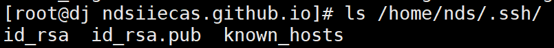
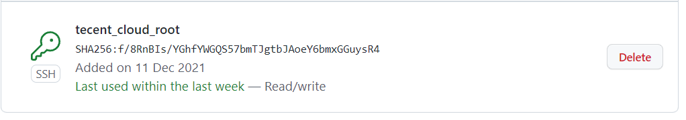
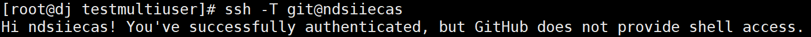
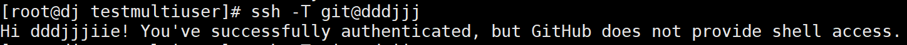

## github多用户SSH免密

1.查看~/.ssh/目录下有三个文件(该文件是用户名为ndsiiecas的密钥)



2.再次生成一个用户名为dddjjj的密钥，注意不要覆盖原文件(这里我们指定生成的文件路径为~/.ssh/id_rsa_dddjjj_github_io)

```shell
ssh-keygen -t rsa -C "1959729097@qq.com"
```


3.在~/.ssh/目录下创建config文件配置如下

```shell
# ndsiiecas.github.io
Host ndsiiecas
    HostName github.com
    IdentityFile ~/.ssh/id_rsa
    User ndsiiecas
# dddjjj.github.io
Host dddjjj
    HostName github.com
    IdentityFile ~/.ssh/id_rsa_dddjjj_github_io
    User dddjjj
```

4.由于id_rsa.pub我们已经添加到Github的SSH Key中，接下来我们只需把新生成的公钥id_rsa_dddjjj_github_io.pub公钥添加到dddjjj账户中的SSH Key中



5.更改账户nds仓库中的remote origin中的url，将ssh的url中"github"更改为~/.ssh/config中的ndsiiecas

```shell
# 未更改：
url = git@github.com:ndsiiecas/testusername.git

# 更改后
url = git@ndsiiecas:ndsiiecas/testusername.git
```

6.同样地，更改账户dddjjj仓库中的remote origin中的url，将github更改为dddjjj

```shell
# 未更改
url = git@github.com:dddjjjiie/testmultiuser.git

# 更改后
url = git@dddjjj:dddjjjiie/testmultiuser.git
```

6.测试，出现以下结果则表示配置成功






**参考**

1.[同一机器配置多个GitHub账户](https://finisky.github.io/multiplegithubaccountsononemachine/)

2.[同一机器部署多个Github账户](https://jieli-matrix.github.io/GithubKyes/)


