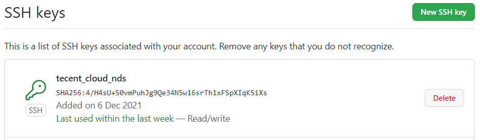

## 将本地仓库推送至远程仓库

1.创建本地仓库并初始化

```shell
mkdir testusername
cd testusername
git init
```

2.在github创建远程仓库testusername


3.配置仓库的用户名以及邮箱

```shell
git config user.name "ndsiiecas"
git config user.email "ybsiiecas@outlook.com"
```

4.在本地创建SSH Key，并查看公钥

```shell
ssh-keygen-t rsa -C "ybsiiecas@outlook.com"
cat ~/.ssh/id_rsa.pub
```

5.将公钥添加到github账户中(头像->settings->ssh & pgp keys->new ssh keys)



6.在本地创建一个文件，并提交到本地仓库

```shell
echo "test" >> test
git add ./
git commit -m "v0.1"
```

7.将本地仓库关联远程仓库，并推送至远程仓库

```
git remote add origin "远程仓库的ssh地址"
git push origin
```


