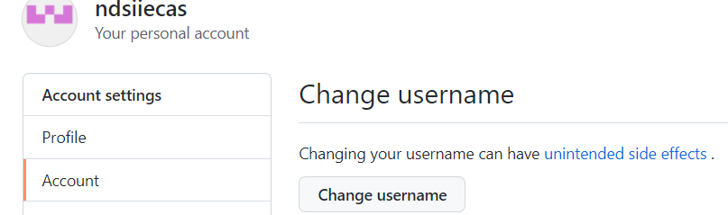
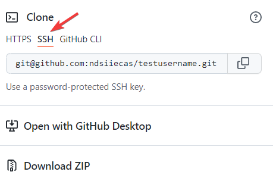

## git用户名和github用户名

1.git设置用户名和邮箱

```
git config user.name "dddjjj"
git config user.email "dddjjj@outlook.com"
```

2.github设置用户名(头像->settings->Account->Change UserName)



#### 关系

github用户名和git设置的用户名没有啥必然关系，只有以下细微的差别

1) 如果本地设置git的user.mail为dddjjj@outlook.com和github的账号dddjjj@outlook.com一致，那么在本地push时跟直接登录到github从网站上修改是相同的，修改人是一样，就是账户拥有者

2) 如果本地设置git的suer.mail为dengjie@outlook.com和github的账号dddjjj@outlook.com不一致，那么在本地push时，github会记录这次修改是另一个人做的


#### SSH免密

使用以下命令生成密钥对时-C指明注使，通常会使用邮箱作为注释，但这个github的邮箱没有什么必然的联系，只是为了便于记忆

```shell
ssh-keygen -t rsa -C "dddjjj@outlook.com"
```


如果我们在本地需要免密操作远程仓库时(push)，我们可以通过以下命令在设置远程仓库，注意仓库的url需要填写仓库的SSH形式的URL

```shell
git remote add origin "git@github.com:ndsiiecas/testusername.git"
```

